# 📚 Estudio de Roles Básicos en Desarrollo Web y Móvil

##  Recurso Oficial para Aprender Git/GitHub - Para Todos 
https://docs.github.com/es/get-started/start-your-journey/git-and-github-learning-resources

## 0) Integrantes del equipo de estudio y sus responsabilidades en el repositorio

| N° | Nombre Completo | Email | Rol Principal | GitHub Username |
|----|-----------------|-------|---------------|-----------------|
| 0  | José Jiménez    | josej@unsa.edu.pe | Product Owner | @jjuarez29 |
| 1  | CONDORI/CATASI, Jonnier Angel | jonnier@unsa.edu.pe | Project Manager | @jonnier |
| 2  | ACHIRI/CUEVAS, Daniel Cooper | daniel@unsa.edu.pe | UI/UX Designer | @daniel |
| 3  | JALA/PARICANAZA, Ronald David | ronald@unsa.edu.pe | Frontend Web Developer | @ronald |
| 4  | MAQUERA/MUSAJA, Kaled Jair | kaled@unsa.edu.pe | Frontend Android Developer | @kaled |
| 5  | APAZA/QUISPE, Gian Franco | gian@unsa.edu.pe | Backend Developer | @gian |
| 6  | MEZA/ROMERO, Osmeyer Eddu | osmeyer@unsa.edu.pe | Backend Developer | @osmeyer |
| 7  | VALENCIA/VILCAS, Jose Carlos | jose@unsa.edu.pe | QA Manual/Functional | @jose |
| 8  | ARCANO/GONZALES, Edgard Darick | edgard@unsa.edu.pe | QA Automation/API | @edgard |
| 9  | VERA/SALCEDO, Luis Alberto | luis@unsa.edu.pe | DevOps/SysAdmin | @luis |
| 10 | VICENTE/MEDINA, Eder Lucio | eder@unsa.edu.pe | Backend Support | @eder |
| 11 | YUCRA/TICONIA, Johan Jeremy | johan@unsa.edu.pe | QA Support | @johan |
| 12 | CAVERO/ALE, Leonardo Ismael | leonardo@unsa.edu.pe | Frontend Support | @leonardo |

## 1) Conceptos Generales para tener en cuenta

### Diferencias entre Librerías, Frameworks y Patrones de Diseño

```mermaid
graph TD
    A[Desarrollo Web/Móvil] --> B[Librerías]
    A --> C[Frameworks]
    A --> D[Patrones de Diseño]
    
    B --> B1[Colección de funciones reutilizables]
    B --> B2[Ejemplos: jQuery, Lodash, Axios]
    B --> B3[Control: Desarrollador llama a la librería]
    
    C --> C1[Estructura completa de aplicación]
    C --> C2[Ejemplos: React, Angular, Django]
    C --> C3[Control: Framework controla el flujo]
    
    D --> D1[Soluciones probadas a problemas comunes]
    D --> D2[Ejemplos: MVC, MVP, MVVM]
    D --> D3[Arquitectura: Estructura del código]
```



**Librerías**: Conjunto de funciones que el desarrollador puede usar cuando las necesite.
**Frameworks**: Estructura que define cómo se debe organizar y escribir el código.
**Patrones de Diseño**: Soluciones arquitectónicas probadas para problemas recurrentes.

## 2) Conociendo Git

### ¿Qué es Git?
Git es un sistema de control de versiones distribuido que permite:

- **Versionado local**: Rastrea cambios en archivos y directorios
- **Historial completo**: Mantiene registro de todas las modificaciones
- **Branching**: Permite trabajar en características paralelas
- **Rollback**: Posibilidad de volver a versiones anteriores

### Comandos Git Esenciales
```bash
# Configuración inicial
git config --global user.name "Tu Nombre"
git config --global user.email "tu@email.com"

# Operaciones básicas
git init                    # Inicializar repositorio
git add .                   # Agregar archivos al staging
git commit -m "mensaje"     # Confirmar cambios
git status                  # Ver estado de archivos
git log                     # Ver historial de commits

# Branching
git branch                  # Listar ramas
git checkout -b nueva-rama  # Crear y cambiar a nueva rama
git merge rama              # Fusionar rama
```

## 3) Conociendo GitHub

### Repositorio Remoto
GitHub es una plataforma que aloja repositorios Git en la nube, permitiendo:

- **Colaboración**: Múltiples desarrolladores trabajando juntos
- **Backup**: Respaldo automático del código
- **Integración**: CI/CD, issues, pull requests
- **Documentación**: README, wikis, páginas

### Configuración de Colaboración


### Supervisión de Conflictos
- **Pull antes de Push**: Siempre actualizar antes de subir cambios
- **Branching Strategy**: Usar ramas para características específicas
- **Code Review**: Revisar cambios mediante Pull Requests
- **Merge conflicts**: Resolver manualmente cuando sea necesario

## 4) Desarrollador Frontend

### Descripción del Rol
El desarrollador Frontend es responsable de crear la interfaz de usuario y la experiencia del usuario en aplicaciones web. Se enfoca en todo lo que el usuario ve e interactúa directamente.

### Habilidades Requeridas
- **Técnicas**:
  - HTML5, CSS3, JavaScript (ES6+)
  - Frameworks: React, Vue.js, Angular
  - Preprocesadores CSS: Sass, Less
  - Build tools: Webpack, Vite, Parcel
  - Control de versiones: Git
  - Responsive Design y Mobile-first
  - Accesibilidad web (WCAG)
  - Testing: Jest, Cypress, Testing Library

- **Blandas**:
  - Atención al detalle visual
  - Colaboración con diseñadores UX/UI
  - Comunicación efectiva
  - Adaptabilidad a nuevas tecnologías

### Relación con otros Roles


- **Con Backend**: Consume APIs y servicios web
- **Con UI/UX**: Implementa diseños y mockups
- **Con QA**: Entrega funcionalidades para testing
- **Con Android**: Comparte lógica de negocio y componentes

### Stack Tecnológico Frontend

#### Lenguajes Base
- **HTML5**: Estructura semántica
- **CSS3**: Estilos y animaciones
- **JavaScript**: Lógica e interactividad
- **TypeScript**: JavaScript tipado

#### Frameworks y Librerías
- **React**: Librería para UI basada en componentes
- **Vue.js**: Framework progresivo
- **Angular**: Framework completo con TypeScript
- **Svelte**: Compilador de componentes

#### Herramientas de Desarrollo
- **Bundlers**: Webpack, Vite, Rollup
- **CSS Frameworks**: Bootstrap, Tailwind CSS, Material UI
- **State Management**: Redux, Vuex, Zustand
- **Testing**: Jest, Vitest, Playwright

## 5) Links Recomendados para Capacitación Frontend

### 🔹 **Sin Certificaciones (Gratuitos)**
- **freeCodeCamp**: https://www.freecodecamp.org/learn/responsive-web-design/
- **MDN Web Docs**: https://developer.mozilla.org/es/docs/Learn
- **The Odin Project**: https://www.theodinproject.com/
- **Frontend Masters Bootcamp**: https://frontendmasters.com/bootcamp/

### 🔹 **Con Certificación**
- **Meta Frontend Developer** (Coursera): https://www.coursera.org/professional-certificates/meta-front-end-developer
- **Google UX Design Certificate**: https://www.coursera.org/professional-certificates/google-ux-design
- **Frontend Web Developer** (edX): https://www.edx.org/learn/front-end-software-engineering

### 🔹 **Proyectos Completos de Ejemplo**
- **30 Days of JavaScript**: https://github.com/Asabeneh/30-Days-Of-JavaScript
- **Frontend Mentor**: https://www.frontendmentor.io/
- **100 Days CSS Challenge**: https://100dayscss.com/

### 🔹 **Recomendadas por Líderes Tech**
- **React Official Tutorial**: https://react.dev/learn
- **Vue.js Guide**: https://vuejs.org/guide/
- **Angular Tutorial**: https://angular.dev/tutorials

## 6) Desarrollador Backend

### Descripción del Rol
El desarrollador Backend maneja la lógica del servidor, bases de datos, APIs y la infraestructura que soporta las aplicaciones web y móviles.

### Habilidades Requeridas
- **Técnicas**:
  - Lenguajes: Python, Java, Node.js, C#, PHP, Go
  - Frameworks: Django, Spring Boot, Express.js, ASP.NET
  - Bases de datos: MySQL, PostgreSQL, MongoDB, Redis
  - APIs: REST, GraphQL, gRPC
  - Cloud: AWS, Azure, Google Cloud
  - DevOps: Docker, Kubernetes, CI/CD
  - Seguridad: OAuth, JWT, HTTPS, SQL Injection prevention

- **Blandas**:
  - Pensamiento lógico y algorítmico
  - Resolución de problemas complejos
  - Capacidad de optimización
  - Trabajo en equipo distribuido

### Stack Tecnológico Backend

#### Lenguajes Principales
- **Python**: Django, Flask, FastAPI
- **JavaScript/Node.js**: Express.js, Nest.js
- **Java**: Spring Boot, Spring Framework
- **C#**: ASP.NET Core, .NET Framework
- **Go**: Gin, Echo, Fiber
- **PHP**: Laravel, Symfony

#### Bases de Datos
- **Relacionales**: MySQL, PostgreSQL, SQLite
- **NoSQL**: MongoDB, CouchDB, Cassandra
- **Cache**: Redis, Memcached
- **Search**: Elasticsearch, Solr

#### Herramientas y Servicios
- **Contenedores**: Docker, Podman
- **Orquestación**: Kubernetes, Docker Swarm
- **Message Queues**: RabbitMQ, Apache Kafka
- **Monitoring**: Prometheus, Grafana, ELK Stack

## 7) Links Recomendados para Capacitación Backend

### 🔹 **Sin Certificaciones**
- **freeCodeCamp Backend**: https://www.freecodecamp.org/learn/back-end-development-and-apis/
- **FastAPI Tutorial**: https://fastapi.tiangolo.com/tutorial/
- **Node.js Guide**: https://nodejs.org/en/learn/getting-started/introduction-to-nodejs

### 🔹 **Con Certificación**
- **Meta Backend Developer**: https://www.coursera.org/professional-certificates/meta-back-end-developer
- **AWS Certified Developer**: https://aws.amazon.com/certification/certified-developer-associate/
- **Microsoft Azure Developer**: https://docs.microsoft.com/en-us/learn/certifications/azure-developer/

### 🔹 **Proyectos Completos**
- **REST API Tutorial**: https://github.com/microsoft/api-guidelines
- **Microservices Patterns**: https://microservices.io/patterns/
- **System Design Primer**: https://github.com/donnemartin/system-design-primer

## 8) Rol QA (Quality Assurance)

### Descripción del Rol
El ingeniero de QA asegura la calidad del software mediante pruebas sistemáticas, identificación de bugs y validación de requisitos funcionales y no funcionales.

### Tipos de QA
- **QA Manual**: Pruebas exploratorias y casos de prueba manuales
- **QA Automatizado**: Scripts de automatización y CI/CD integration
- **Performance Testing**: Pruebas de carga y rendimiento
- **Security Testing**: Pruebas de vulnerabilidades

### Habilidades Requeridas
- **Técnicas**:
  - Testing frameworks: Selenium, Cypress, Playwright
  - API Testing: Postman, Newman, REST Assured
  - Performance: JMeter, LoadRunner, K6
  - Mobile Testing: Appium, Espresso, XCTest
  - Bug tracking: Jira, Azure DevOps, Linear
  - Programming: Python, JavaScript, Java

- **Metodológicas**:
  - Test case design y execution
  - Defect lifecycle management
  - Risk assessment
  - Agile/Scrum methodologies

### Responsabilidades en el Proyecto
- **Planificación**: Crear estrategias y planes de prueba
- **Ejecución**: Realizar pruebas manuales y automatizadas
- **Reporte**: Documentar bugs y métricas de calidad
- **Automatización**: Desarrollar scripts de prueba
- **Colaboración**: Trabajar con developers para resolver issues

## 9) Links Recomendados para Capacitación QA

### 🔹 **Sin Certificaciones**
- **Coding Temple QA Program**: https://www.codingtemple.com/free-courses/quality-assurance/
- **GURU99 Testing Tutorial**: https://www.guru99.com/software-testing.html
- **Test Automation University**: https://testautomationu.applitools.com/

### 🔹 **Con Certificación**
- **ISTQB Foundation Level**: https://www.istqb.org/
- **Selenium WebDriver**: https://www.selenium.dev/documentation/
- **Postman Student Expert**: https://academy.postman.com/

### 🔹 **Herramientas Prácticas**
- **Cypress Real Examples**: https://example.cypress.io/
- **API Testing with Postman**: https://learning.postman.com/
- **Performance Testing Guide**: https://jmeter.apache.org/usermanual/

## 10) Desarrollador Android

### Descripción del Rol
Desarrolla aplicaciones móviles nativas para dispositivos Android, enfocándose en la experiencia móvil y las capacidades específicas del sistema operativo.

### Arquitectura Android


### Habilidades Requeridas
- **Lenguajes**: Kotlin (preferido), Java
- **Android SDK**: Activities, Services, Fragments
- **UI**: XML layouts, Jetpack Compose
- **Architecture**: MVVM, MVP, Clean Architecture
- **Libraries**: Retrofit, Room, Dagger/Hilt
- **Testing**: JUnit, Espresso, Mockito
- **Tools**: Android Studio, Gradle, ADB

### Componentes Principales
- **Activities**: Pantallas de la aplicación
- **Fragments**: Porciones reutilizables de UI
- **Services**: Operaciones en background
- **Broadcast Receivers**: Respuesta a eventos del sistema
- **Content Providers**: Compartir datos entre apps

### Jetpack Compose vs Views Tradicionales

| Característica | Views XML | Jetpack Compose |
|---|---|---|
| **Paradigma** | Imperativo | Declarativo |
| **Código** | XML + Kotlin/Java | Solo Kotlin |
| **Performance** | Buena | Optimizada |
| **Curva de aprendizaje** | Tradicional | Moderna |
| **Futuro** | Mantenimiento | Desarrollo activo |

## 11) Links Recomendados para Capacitación Android

### 🔹 **Oficiales de Google**
- **Android Basics with Compose**: https://developer.android.com/courses/android-basics-compose/course
- **Android Developer Guides**: https://developer.android.com/guide
- **Google Codelabs**: https://developers.google.com/codelabs

### 🔹 **Cursos Estructurados**
- **Meta Android Developer**: https://www.coursera.org/professional-certificates/meta-android-developer
- **Android Development for Beginners**: https://www.udacity.com/course/android-development-for-beginners--ud837
- **Kotlin Bootcamp**: https://developer.android.com/courses/kotlin-bootcamp/overview

### 🔹 **Recursos Avanzados**
- **Architecture Samples**: https://github.com/android/architecture-samples
- **Jetpack Compose Samples**: https://github.com/android/compose-samples
- **Android Testing Samples**: https://github.com/android/testing-samples

## 12) Pasos a Desarrollar

### Flujo de Trabajo del Proyecto


### 1. Configuración Inicial del Repositorio
**Integrante 0 (Product Owner)**:
```bash
# Crear repositorio remoto en GitHub
# Nombre: EstudioRolesBasicos
# Descripción: Proyecto de aprendizaje para roles en desarrollo web y móvil
# Visibilidad: Private (para el equipo)
```

### 2. Configuración de Colaboradores
**En GitHub**:
1. Ir a Settings ⚙️ > Collaborators and teams
2. Click en "Add people"
3. Invitar usando GitHub username o email
4. Asignar permisos: "Write" para todos los miembros

### 3. Clonación y Setup Local
**Todos los compañeros**:
```bash
# Crear directorio de trabajo
mkdir desarrollo-web-movil
cd desarrollo-web-movil

# Clonar repositorio
git clone https://github.com/jjuarez29/EstudioRolesBasicos.git
cd EstudioRolesBasicos

# Verificar contenido
ls -la  # Linux/Mac
dir     # Windows

# Configurar Git local
git config user.name "Tu Nombre"
git config user.email "tu@email.com"
```

### 4. Estructura de Branches
```bash
# Branch principal
main

# Branches por funcionalidad
feature/frontend-web
feature/frontend-android  
feature/backend-api
feature/qa-automation
feature/documentation
```

### 5. Metodología de Trabajo

#### Sprint Planning (Semanal)
- **Lunes**: Planning meeting (1 hora)
- **Miércoles**: Mid-sprint check (30 min)
- **Viernes**: Sprint review y retrospectiva (1 hora)

#### Daily Standups (15 min)
- ¿Qué hice ayer?
- ¿Qué haré hoy?
- ¿Hay algún impedimento?

#### Pull Request Workflow
```bash
# 1. Crear feature branch
git checkout -b feature/mi-funcionalidad

# 2. Hacer cambios y commits
git add .
git commit -m "feat: implementar nueva funcionalidad"

# 3. Push a GitHub
git push origin feature/mi-funcionalidad

# 4. Crear Pull Request en GitHub
# 5. Code Review por 2 miembros del equipo
# 6. Merge después de aprobación
```

## 📋 Cronograma del Proyecto (8 semanas)

| Semana | Fase | Responsables | Entregables |
|--------|------|-------------|-------------|
| 1-2 | **Setup y Fundamentos** | Todos | Configuración de herramientas, Git/GitHub |
| 3-4 | **Diseño y Arquitectura** | UI/UX, Backend leads | Wireframes, API design, DB schema |
| 5-6 | **Desarrollo Core** | Frontend, Backend, Android | MVP funcional |
| 7 | **Testing e Integración** | QA, DevOps | Testing suite, CI/CD |
| 8 | **Deploy y Documentación** | Todos | Aplicación desplegada, documentación |

## 🛠 Herramientas de Colaboración

### Comunicación
- **Slack/Discord**: Chat diario del equipo
- **Google Meet**: Reuniones semanales
- **GitHub Discussions**: Decisiones técnicas

### Gestión de Proyecto
- **GitHub Projects**: Kanban board
- **GitHub Issues**: Tracking de tareas y bugs
- **GitHub Milestones**: Hitos del proyecto

### Documentación
- **README.md**: Información general del proyecto
- **Wiki**: Documentación técnica detallada
- **ADRs**: Architecture Decision Records

## 📚 Recursos Adicionales

### Libros Recomendados
- **"Clean Code"** by Robert Martin
- **"System Design Interview"** by Alex Xu
- **"You Don't Know JS"** series
- **"Android Programming"** by Big Nerd Ranch

### Newsletters y Blogs
- **Frontend**: CSS-Tricks, Smashing Magazine
- **Backend**: InfoQ, High Scalability
- **Mobile**: Android Developers Blog
- **QA**: Ministry of Testing, Test Automation Patterns

### Conferencias y Eventos
- **Frontend**: JSConf, React Conf
- **Backend**: DockerCon, KubeCon
- **Mobile**: Google I/O, Android Dev Summit
- **QA**: SeleniumConf, Agile Testing Days

---

## 🎯 Objetivos de Aprendizaje

Al finalizar este estudio, cada miembro del equipo habrá:

1. **Comprendido** los roles y responsabilidades en desarrollo de software
2. **Practicado** con las herramientas y tecnologías de su área
3. **Colaborado** efectivamente usando Git/GitHub
4. **Desarrollado** un proyecto completo de principio a fin
5. **Documentado** su experiencia y aprendizajes

---

## 📞 Contacto y Soporte

**Project Owner**: José Jiménez (josej@unsa.edu.pe)  
**GitHub Repository**: https://github.com/jjuarez29/EstudioRolesBasicos  
**Horario de consultas**: Lunes a Viernes, 14:00 - 16:00 hrs

---
